# Jenkins自动化部署

## 安装
### 1、下载 https://www.jenkins.io/download/  （这是在Windows直接下载安装包）
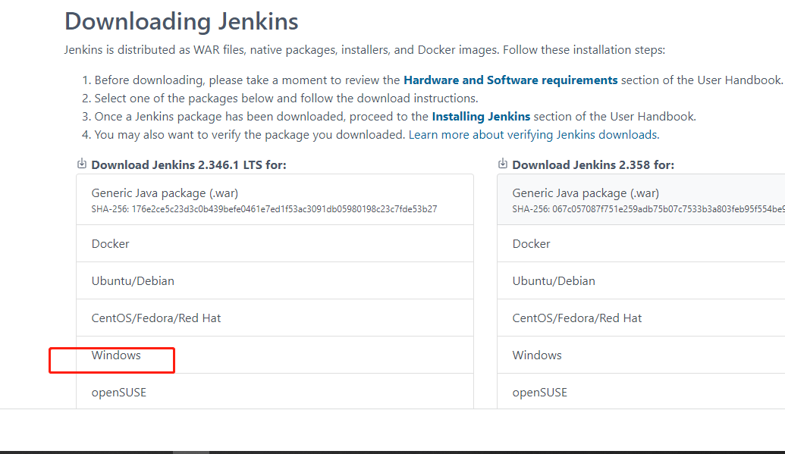
一直Next进行  

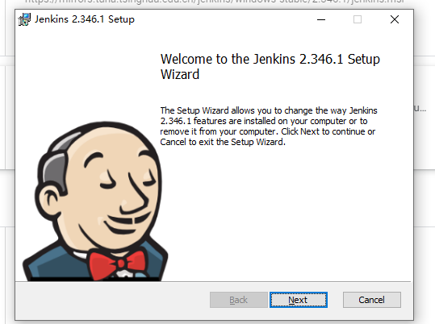

### 2、注册 https://www.jenkins.io/zh/doc/book/installing/#unlocking-jenkins （密码安装截图提示路径去找相应文件）

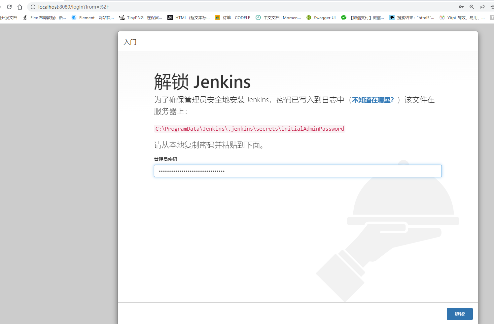
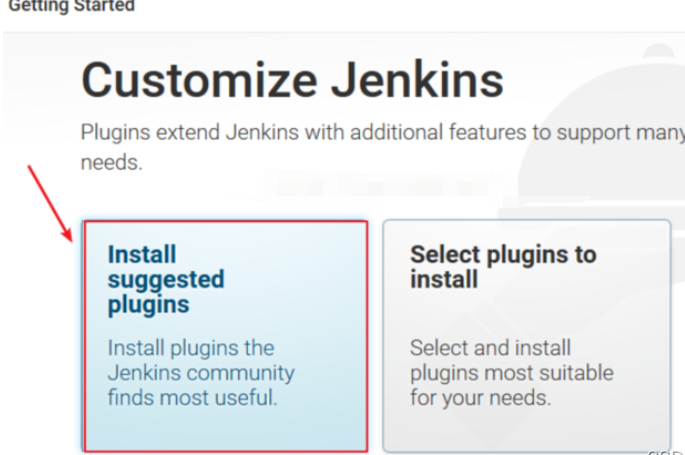 

设置登录账号、密码、邮箱 

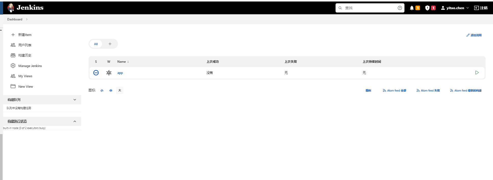

## 部署
  ### 1.安装GitLab Authentication plugin，GitLab Plugin，Publish Over SSH，Credentials plugin 插件 
  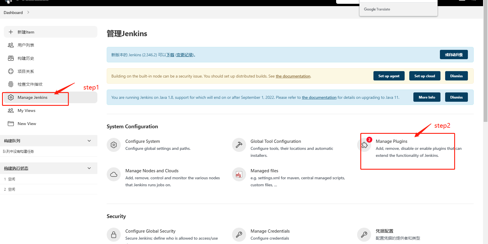
  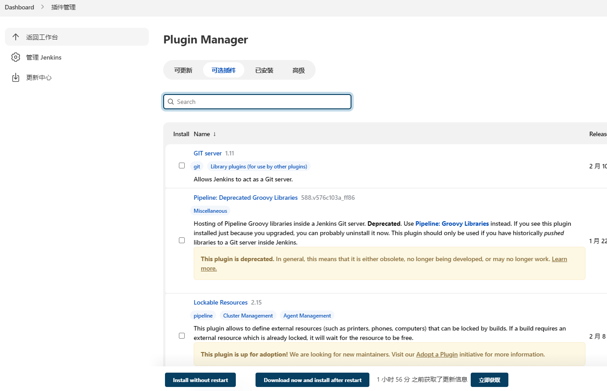

  ### 2.添加凭据 
  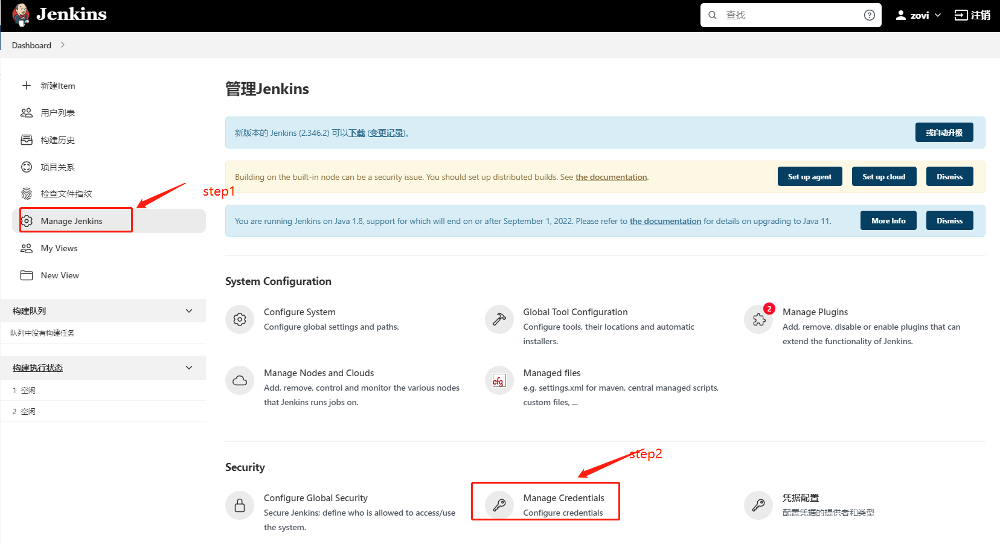
  
  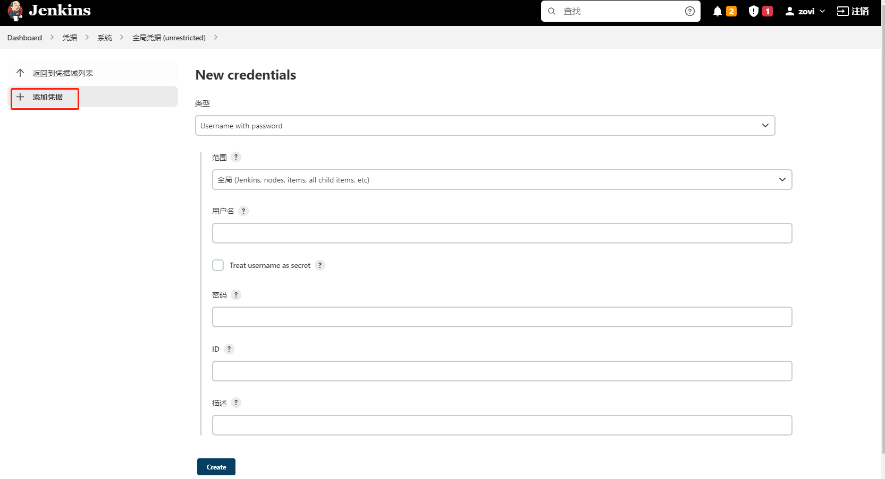
  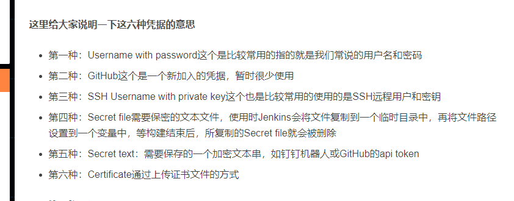

  **注：SSH的密钥是id_rsa文件的key**
  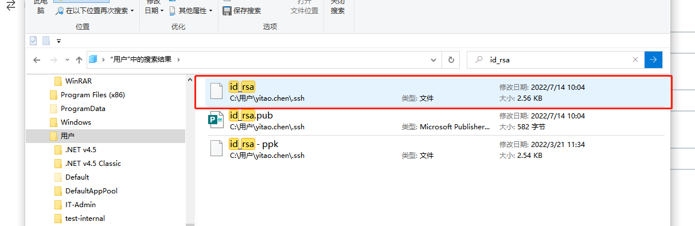

  添加脚本语言（避免执行shell报错）
  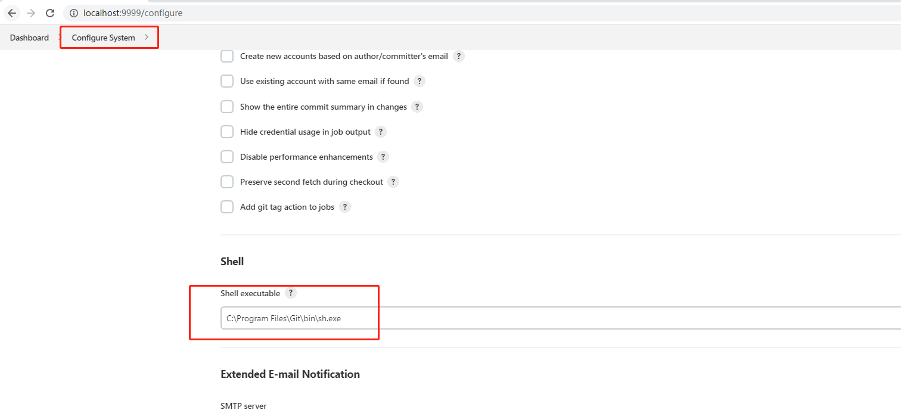

  ### 3、添加项目
  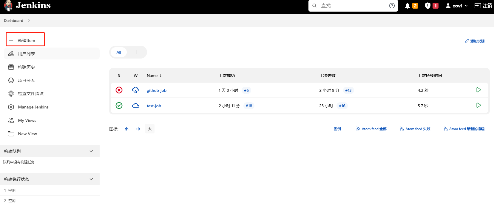
  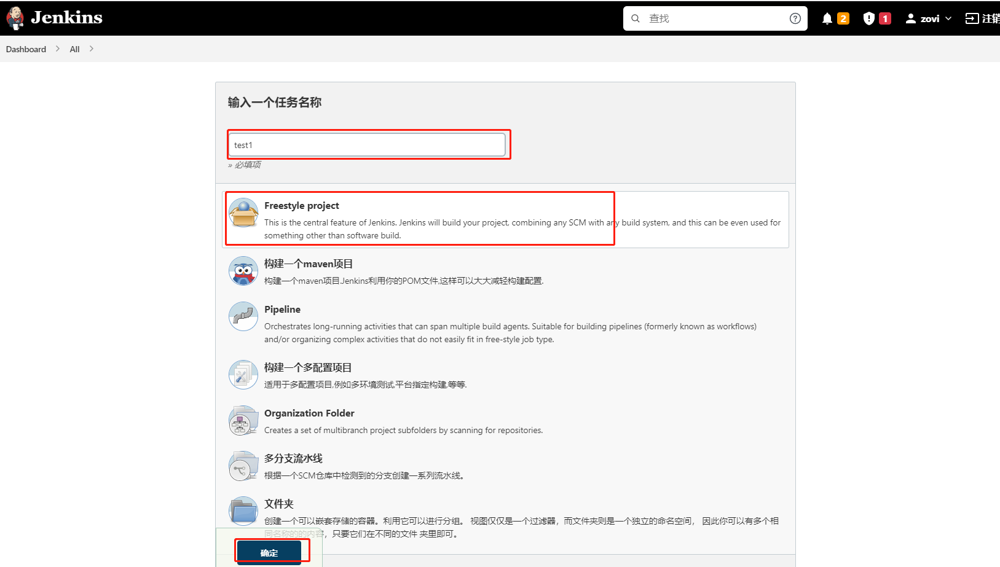
  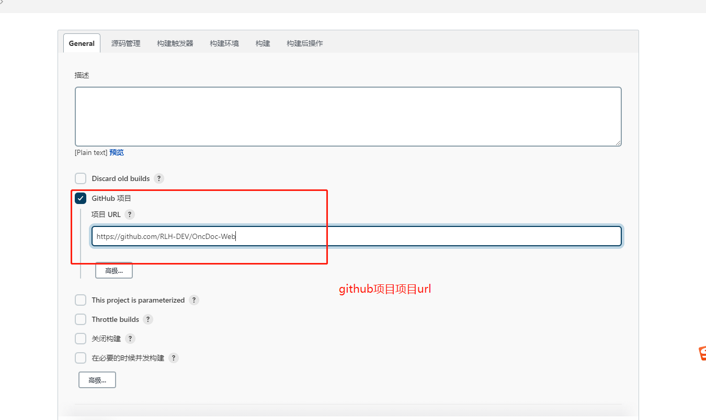
  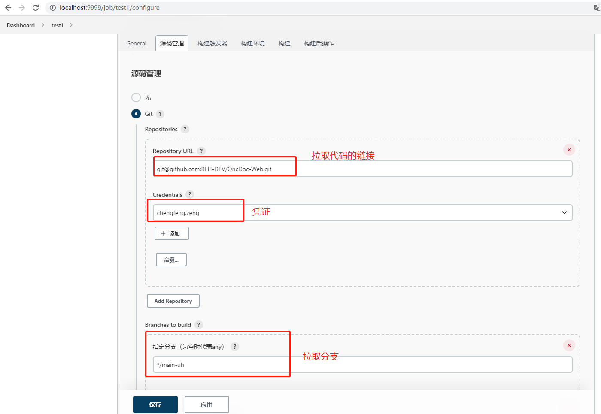
  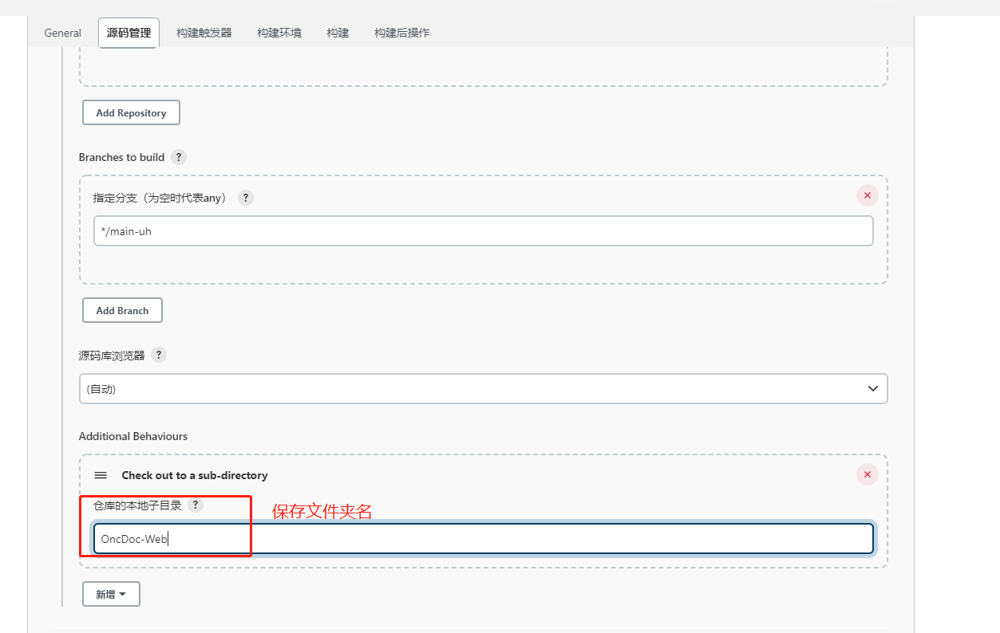
  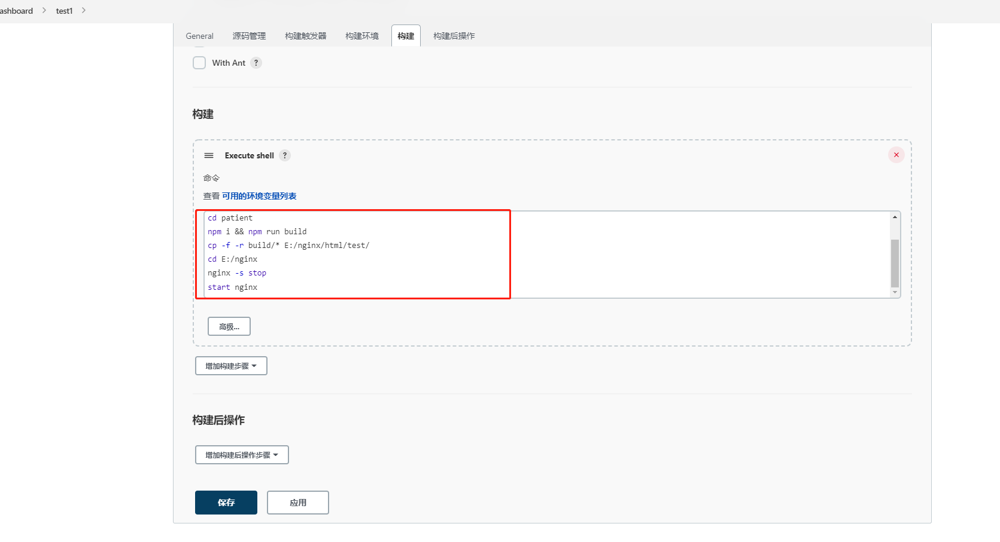

  保存

  ## 4、下载nginx 

  ### 4.1 http://nginx.org/en/download.html（我这里是下载Windows版本）
  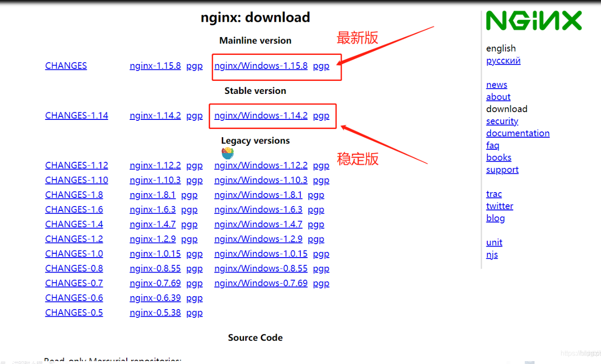

  ### 4.2 解压后运行nginx
  直接在文件夹双击nginx.exe或者用cmd cd到文件夹运行输入命令 nginx.exe 或者 start nginx ，回车即可完成启动

  

  ### 4.3 设置nginx server
  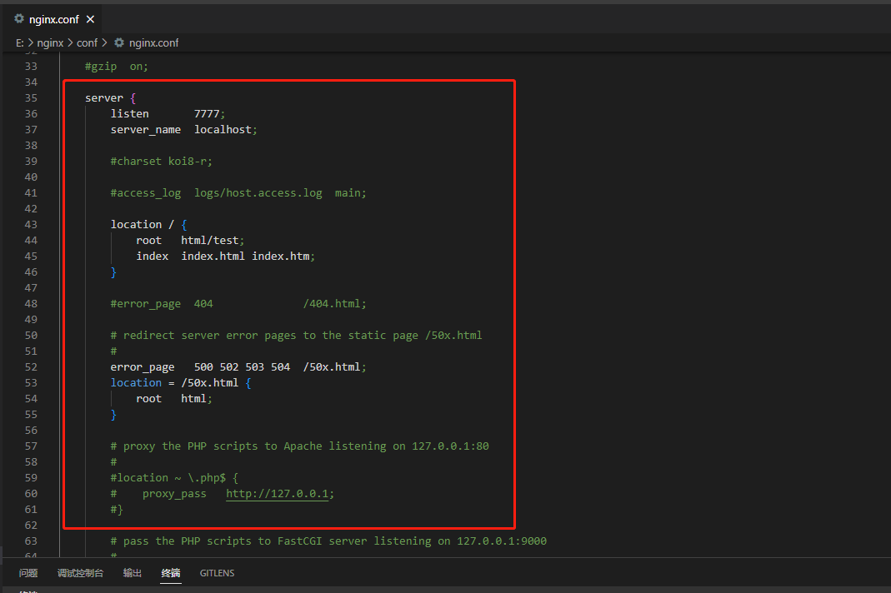

  打开http://localhost:7777/